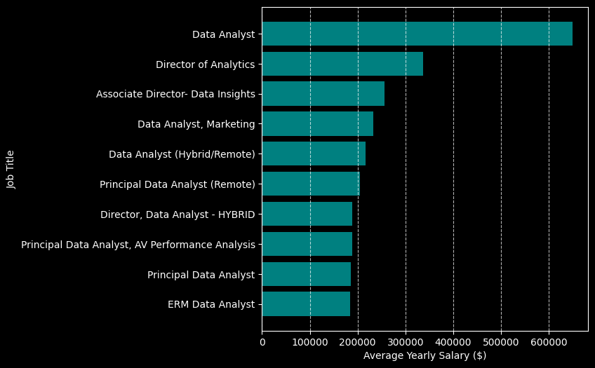
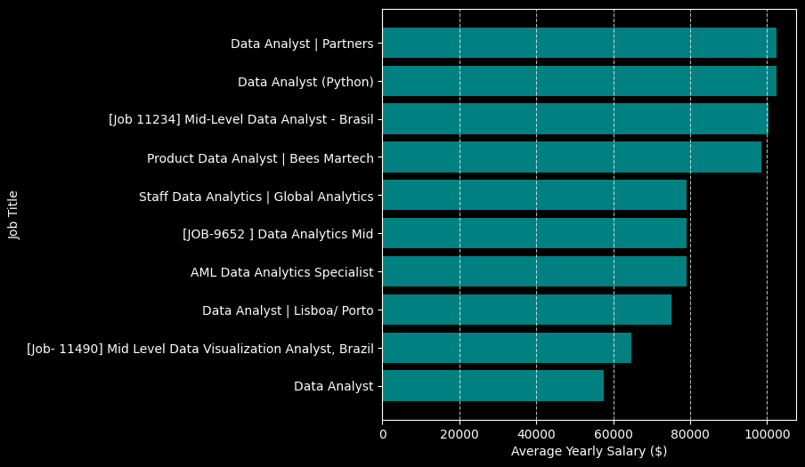
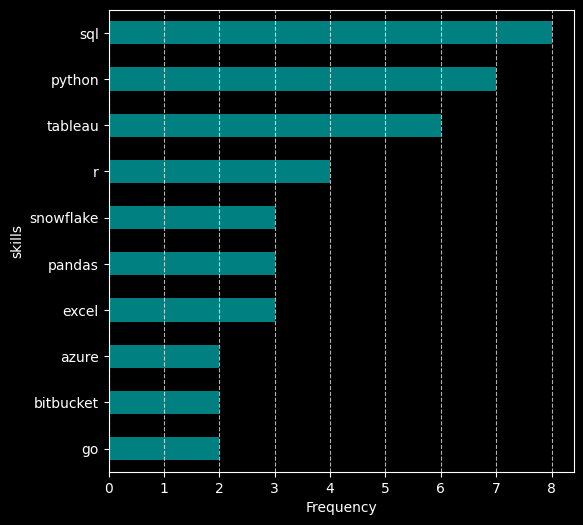
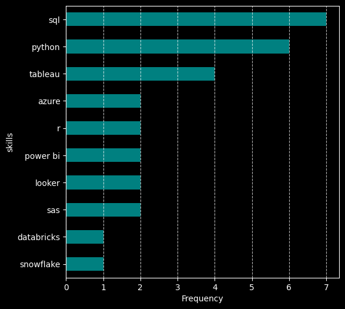

# Introduction
Diving into the data job market, in this project I focused on Data Analyst roles to explore top-paying jobs and in-demand skills on both remote jobs around the world, and jobs located on Brazil to compare them.

Check out the SQL queries here: [project_sql folder](/project_sql/)

# Background
Driven by a quest to navigate the data analyst job market in and out of Brazil, this project was born from a desire to pinpoint top-paid and in-demand skills, to find optimal jobs.

The data comes from the app [datanerd.tech](https://datanerd.tech/) made by [Luke Barousse](https://www.lukebarousse.com/), which is packed with insights on job titles, salaries, locations, and essential skills.

### The questions I wanted to answer through my SQL queries were:

1. What are the top-paying data analyst jobs?
2. What skills are required for these top-paying jobs?
3. What skills are most in demand for data analysts?
4. Which skills are associated with higher salaries?

For each one of these I mad a query for remote jobs around the world, and other query for local jobs on Brazil to compare them.

# Tools I Used
For my deep dive into the data analyst job market, I usde the following tools:

- **SQL:** The backbone of my analysis, allowing me to query the database and gain insights.
- **PostgreSQL:** The chosen database management system, ideal for handling the job posting data.
- **Git & GitHub:** Essencial for version control and sharing my SQL scripts and analysis, ensuring collaboration and project tracking.

# The Analysis
Each query for this project aimed at investigating specific aspects of the data analyst job market. Here's how I approached each question:

## 1. Top Paying Data Analyst Jobs
To identify the highest-paying roles, I filtered data analyst positions by average yearly salary and location. This query highlights the high paying opportunities in the field.

```sql
SELECT
    job_id,
    job_title,
    job_location,
    salary_year_avg,
    name AS company_name
FROM job_postings_fact AS jb
LEFT JOIN company_dim AS cd ON cd.company_id = jb.company_id
WHERE
    job_title_short = 'Data Analyst' AND
    job_work_from_home = TRUE AND
    salary_year_avg IS NOT NULL
ORDER BY salary_year_avg DESC
LIMIT 10;
```

On this query I'm looking at the remote jobs. Changing the line `job_work_from_home = TRUE` on the `WHERE` clause to `job_location LIKE '%Brazil%'` we get top jobs located on Brazil. This change will happen on every subsequent query of this analysis. For more details checkout the [SQL files](/project_sql/).

### Remote Jobs

- **Wide Salary Range:** Top 10 paying data analyst roles span from $184,000 to $650,000, which makes sense since we're looking at world wide range of remote jobs.
- **Diverse Employers:** Companies like SmartAsset (finances), Meta (technology), and AT&T (telecommunications) are among those offering high salaries, showing a broad interest across different industries.
- **Job Titles Variety:** Most of these high paying jobs are important positions like Director of Analytics and Principal Data Analyst, but still has the base position of a Data Analyst among them, indicating a good variety of roles and specializations within data analytics.




### Brazil Jobs

- **Lower and Uniformed Salaries:** In comparison, the Brazil jobs have a much lower salary value and range between them, going from $57,500 to $102,500.
- **Diverse Employers:** The company diversity stays the same, we have companies like CI$T (information technology), Gympass (fitness aggregator) and Nubank, keeping up the interest across different industries trend.
- **Job Titles Variety** For the top Brazil jobs we have most of them being normal Data Analyst positions and some of them being mid-level, which indicates a lower variety compared to the remote jobs.



## 2. Skills for Top Paying Jobs
To understand what skills are required for the top-paying jobs, I joined the job postings with the skills data, providing insights into what employers value for high-compensation roles.

```sql
WITH tob_paying_jobs AS (
    SELECT
        job_id,
        job_title,
        job_location,
        salary_year_avg,
        name AS company_name
    FROM job_postings_fact AS jb
    LEFT JOIN company_dim AS cd
        ON cd.company_id = jb.company_id
    WHERE
        job_title_short = 'Data Analyst' AND
        job_work_from_home = TRUE AND
        salary_year_avg IS NOT NULL
    ORDER BY salary_year_avg DESC
    LIMIT 10
)

SELECT
    tpj.*,
    skd.skills
FROM tob_paying_jobs AS tpj
INNER JOIN skills_job_dim AS sk ON sk.job_id = tpj.job_id
INNER JOIN skills_dim AS skd ON skd.skill_id = sk.skill_id
ORDER BY salary_year_avg DESC
```

Running this query for both remote jobs and Brazil jobs we get the following:

### Remote Jobs



### Brazil Jobs



For both we have **SQL**, **Python** and **Tableau** dominating the top 3 skills which is the bear bones of data analysis. Meanwhile, on the remote jobs we have skills like **Snowflake**, **Pandas** and **Excel** which indicates a demand on data manipulation and cloud data storage, and on the Brazil jobs we have a bigger attention on business intelligence and statistical analysis with skills like **Power BI**, **Looker** and **SAS**.

## 3. In-Demand Skills for Data Analysts
This query helped identify the skills most frequently requested in job postings, directing focus to areas with high demand.

```sql
SELECT
    skd.skills,
    COUNT(sk.job_id) AS demand_count
FROM job_postings_fact AS jpt
INNER JOIN skills_job_dim AS sk ON sk.job_id = jpt.job_id
INNER JOIN skills_dim AS skd ON skd.skill_id = sk.skill_id
WHERE 
    job_title_short = 'Data Analyst' AND
    job_work_from_home = TRUE AND
GROUP BY skd.skills
ORDER BY demand_count DESC
LIMIT 5
```

### Remote Jobs

| Skills   | Demand Count |
|----------|--------------|
| SQL      | 7921         |
| Excel    | 4611         |
| Python   | 4330         |
| Tableau  | 3745         |
| Power BI | 2609         |

### Brazil Jobs

| Skills   | Demand Count |
|----------|--------------|
| SQL      | 264          |
| Python   | 211          |
| PowerBI  | 126          |
| Tableau  | 111          |
| Excel    | 100          |

When it comes to skills demands on job postings we don't see much difference between the two results, **SQL** remain fundamental, emphasizing the need for strong foundational skills in data processing. But just like on the last analysis, the focus on business intelligence of the Brazil jobs it's noticeable with skills like PowerBI being more popular, pointing towards the increasing importance of technical skills in data storytelling and decision support.

## 4. Skills Based on Salary
Exploring the average salaries associated with different skills revealed which skills are the highest paying.

```sql
SELECT
    skd.skills,
    ROUND(AVG(salary_year_avg), 0) AS avg_salary
FROM job_postings_fact AS jpt
INNER JOIN skills_job_dim AS sk ON sk.job_id = jpt.job_id
INNER JOIN skills_dim AS skd ON skd.skill_id = sk.skill_id
WHERE 
    job_title_short = 'Data Analyst' AND
    job_work_from_home = TRUE AND
    salary_year_avg IS NOT NULL
GROUP BY skd.skills
ORDER BY avg_salary DESC
LIMIT 20
```

For the analysis of the top 20 paying skills I asked ChatGPT for insights into trends of the jobs. Here's a breakdown:

### Remote Jobs

- **Cloud & Big Data Pay Well:** Skills like **PySpark ($208K)**, **Databricks**, and **Snowflake** are among the highest-paying, indicating demand for big data engineering expertise.

- **AI & Automation Are Valuable: IBM Watson ($160K)** and **DataRobot ($155K)** suggest that AI-driven analytics and automation tools significantly boost earning potential.

- **DevOps & Version Control Add Value: Bitbucket ($189K)** highlights the importance of DevOps and version control systems in data analysis roles.

| Skills        | Average Salary |
|---------------|----------------|
| Pyspark       | 208,172        |
| Bitbucket     | 189,155        |
| Watson        | 160,515        |
| Couchbase     | 160,515        |
| Datarobot     | 155,486        |
| Gitlab        | 154,500        |
| Swift         | 153,750        |
| Jupyter       | 152,777        |
| Pandas        | 151,821        |
| Elasticsearch | 145,000        |

*Table of the average salary for the top 10 paying skills for remote data analysts jobs*

### Brazil Jobs

- **Cloud Skills Are Essential: Databricks ($100K)**, **Azure ($82K)**, and **Snowflake ($79K)** show that cloud-based data management skills are top earners.

- **Visualization Tools Pay Well: Tableau ($81K)** remains one of the highest-paying skills, showing demand for strong data visualization capabilities.

- **Python Still Matters: Python ($79K)** is a strong-paying skill, reinforcing its importance for analytics, automation, and data science.

| Skills     | Average Salary ($)|
|------------|-------------------|
| Databricks | 100,500           |
| Azure      | 82,650            |
| Tableau    | 81,425            |
| Snowflake  | 79,200            |
| Python     | 79,014            |
| SQL        | 76,171            |
| MySQL      | 75,068            |
| SAS        | 75,068            |
| R          | 70,471            |
| Looker     | 68,350            |

*Table of the average salary for the top 10 paying skills for Brazil located data analysts jobs*

# What I Learned

- **Complex Query Crafting:** Mastered the art of advanced SQL, merging tables tables and using **WITH** clauses for temp tables maneuvers.

- **Data Aggregation:** Got familiar with **GROUP BY** and turned aggregate functions like **COUNT()** and **AVG()** data-summarizing abillities.

- **Analytical Skills:** Enhanced my real-world problem-solving skills, turning questions into applicable, insight SQL queries.

# Conclusions

## Insights

Comparing both Brazil and remote top paying jobs, we can see that the Brazil Data Science market have very little specialized Data Analyst roles, probably suggesting that the data driven culture is still growing on the country. Looking at the demand and salary of skills we can see that the remote roles have a higher focus on specialization in AI, automation and big data processing, while the Brazilian roles focus more on cloud and visualization, leaning towards business intelligence.
